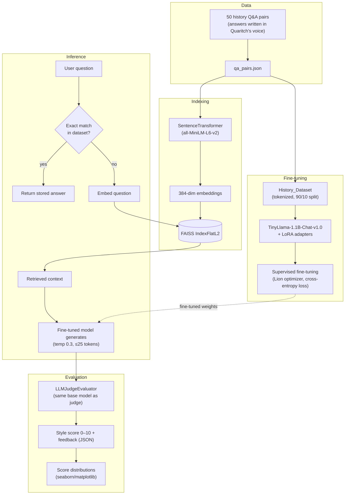

<p align="center">
  <!-- Keep the banner image line from your current README here (drag-and-drop image markdown) -->
  
</p>

<h1 align="center">History Chatbot: Colonel Miles Quaritch Style</h1>

<p align="center">
  A fine-tuned, retrieval-augmented history chatbot that answers trivia questions in the voice of Colonel Miles Quaritch — Avatar's gruff, militaristic colonel.
</p>

<p align="center">
  <a href="https://colab.research.google.com/github/ivyanalyst/LLM_RAG_History_Chatbot_Colonel-Miles-Quaritch_style/blob/main/Quaritch_Finetuning_Chatbot.ipynb">
    
  </a>
  
  
</p>

---

## Overview

This project fine-tunes **TinyLlama-1.1B-Chat-v1.0** with **LoRA** on a small set of history question/answer pairs rewritten in Colonel Quaritch's voice, then wraps the model in a **retrieval-augmented generation (RAG)** pipeline so answers stay grounded in the source dataset instead of drifting. A separate **LLM-as-judge** step scores generations on how well they match the target style, with results visualized as score distributions.

Built entirely as a single Google Colab notebook (`Quaritch_Finetuning_Chatbot.ipynb`) — GPU runtime required.

## Table of contents

- [Architecture](#architecture)
- [Tech stack](#tech-stack)
- [Project structure](#project-structure)
- [Getting started](#getting-started)
- [Dataset](#dataset)
- [Results](#results)
- [Example](#example)
- [Limitations](#limitations)
- [Roadmap](#roadmap)
- [Acknowledgements](#acknowledgements)
- [License](#license)

## Architecture



**Indexing** — Every answer in `qa_pairs.json` is embedded with `sentence-transformers/all-MiniLM-L6-v2` and stored in a `faiss.IndexFlatL2` index for similarity search.

**Fine-tuning** — `History_Dataset` tokenizes each `Q: ... A: ...` pair (block size 128) and feeds a 90/10 train/test split into a manual training loop: forward pass → shifted cross-entropy loss → backward pass, optimized with `Lion`, for up to 10 epochs or 1000 steps.

**Inference (`chat()`)** — First checks for an exact (case-insensitive) match against the raw dataset. If none is found, it embeds the question, retrieves the closest answer from FAISS as context, and generates a response with the fine-tuned model.

**Evaluation (`LLMJudgeEvaluator`)** — Uses the same base model with a style-scoring system prompt to rate how "Quaritch" a piece of text sounds, returning a JSON score (0–10, normalized to 0–1) and short feedback. Scores across base text, model generations, and hand-written style examples are compared and plotted.

**Reinforcement learning (`rl_train`, present but not wired into the main path)** — A PPO-based loop (via `trl`) intended to further push generations toward the target style using the judge's score as a reward signal.

## Tech stack

| Purpose                          | Library                                   |
|-----------------------------------|--------------------------------------------|
| Base model                          | `TinyLlama/TinyLlama-1.1B-Chat-v1.0`     |
| Parameter-efficient fine-tuning       | `peft` (LoRA)                          |
| Training loop / optimizer               | PyTorch, `lion-pytorch`             |
| Reinforcement learning (WIP)              | `trl` (`PPOTrainer`, `PPOConfig`)  |
| Sentence embeddings                          | `sentence-transformers`         |
| Vector search                                  | `faiss-cpu`                   |
| Data handling                                    | `datasets`, `pandas`, `numpy`|
| Evaluation / visualization                        | `seaborn`, `matplotlib`     |
| Environment                                         | Google Colab (GPU runtime)|

## Project structure

```
.
├── Quaritch_Finetuning_Chatbot.ipynb   # Full pipeline: data → index → fine-tune → chat → evaluate
├── README.md
├── Result.md                            # Training loss curves and qualitative notes
└── LICENSE
```

## Getting started

1. Click **Open in Colab** above (or open `Quaritch_Finetuning_Chatbot.ipynb` directly on GitHub and choose "Open in Colab").
2. In Colab, go to **Runtime → Change runtime type** and select a GPU.
3. Add your Hugging Face token as a Colab **Secret** named `HF_TOKEN` (Secrets panel, left sidebar) — the notebook reads it via `google.colab.userdata`.
4. Run all cells top to bottom. The first cells install dependencies (`transformers`, `peft`, `trl`, `sentence-transformers`, `faiss-cpu`, etc.) and patch a `libstdc++` version needed for some of these packages on Colab's default image.

This notebook is Colab-specific (it uses `!pip install`, `!wget`, and `google.colab.userdata`) and isn't set up to run as a standalone local script.

## Dataset

50 history trivia question/answer pairs, with every answer rewritten in Colonel Quaritch's voice. Example:

```json
{
  "question": "Who was the first President of the United States?",
  "answer": "George Washington, the toughest son of a gun to lead this nation. First in war, first in peace, and first to kick ass in the Oval Office."
}
```

The dataset is generated in-notebook by `prepare_data()` and written to `qa_pairs.json` at runtime.

## Results

From a training run at temperature 0.3, learning rate 5e-4:

- Loss dropped from **2.6046 → 0.1544** over training.
- The model picks up the target style, but with a small (50-pair) dataset, it tends to **repeat phrases** — a sign of overfitting.

See [`Result.md`](./Result.md) for the loss curve plots.

## Example

```
User Query: Who was the first President of the United States?
Retrieved Answer: George Washington, the toughest son of a gun to lead this nation...
Final Response: George Washington. First in war, first in peace, and the first to run this outfit right.
```

## Limitations

- **Small dataset (50 pairs) → overfitting.** The model memorizes and repeats phrases rather than generalizing style to novel questions.
- **Retrieval-dependent accuracy.** If FAISS doesn't have a relevant answer indexed, generation quality drops — the model isn't a general-purpose history model.
- **Style bias by design.** The aggressive, militaristic tone is intentional, but it isn't appropriate for all use cases or audiences.
- **Compute-constrained.** Built to fit within Colab's free-tier limits (TinyLlama + LoRA rather than a larger base model).
- **Colab-only.** No standalone script/CLI entry point outside the notebook.

## Roadmap

- [ ] Expand the QA dataset beyond 50 pairs to reduce overfitting
- [ ] Wire the PPO/`rl_train` reward loop into the main training path (currently defined but unused)
- [ ] Add early stopping / regularization to curb repetition
- [ ] Provide a non-Colab (local/script) entry point
- [ ] Cache/persist FAISS embeddings instead of recomputing per run

## Acknowledgements

- [MIT Introduction to Deep Learning](http://introtodeeplearning.com)
- [DialoGPT Chatbot Space (Hugging Face)](https://huggingface.co/spaces/hummingbirdhumbles/DialoGPTChatbot)
- [Coursera: Deep Learning Specialization](https://www.coursera.org/specializations/deep-learning)

## License

MIT License. Use and/or modification of this code (free of charge, not for resale) must include a reference to this repository: `https://github.com/ivyanalyst/LLM_RAG_History_Chatbot_Colonel-Miles-Quaritch_style`. See [`LICENSE`](./LICENSE) for full terms.
